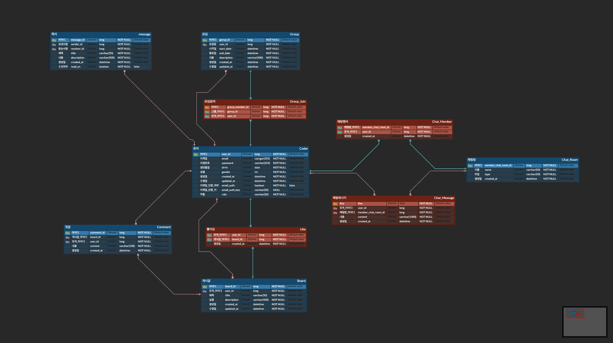

# 개인 프로젝트 기획

---

## 주제: 동아리 홈페이지(이름: Colub)

### 컨셉: 코딩 동아리 홈페이지를 만들어보자!

---

### 생각나는 기능들…

1. 회원기능(회원가입, 로그인, 탈퇴, 로그아웃, 인증)
2. 실시간 채팅 OR 쪽지 기능(개인, 단체)
3. 모임기능(장소, 메일전송)
4. 중고물품 판매 기능(댓글 기능)
5. 게시판 기능(좋아요, 댓글 기능)
6. 관리자 기능

### 프로젝트 기획 배경(목적)

COVID-19로 사라진 오프라인 코딩 동아리 활성화를 위해 도전하게 되었음.

### 프로젝트 진행

### 프로젝트 구조

### ERD

### 사용 예정 기술 스택

1. Front: thymeleaf + bootstrap
2. Back: Spring Boot
3. DB: MySQL(MariaDB) + ORM: JPA(+ Spring Data JPA)
4. Mail: Google SMTP
5. Tool: Intellij UE, Datagrip, GitHub,
6. Chat: WebSocket

### 상세 기능들

---

#### 회원

- **회원가입**: 이메일, 비밀번호, 생년월일을 통해 가입 가능, 중복 이메일 가입 불가
- **인증**: 회원 가입시 이메일 인증을 통해서 회원 인증
- **로그인**: 아이디와 비밀번호가 유효할 때 로그인 가능
- **로그아웃**
- **탈퇴**: 마이페이지에서 탈퇴 가능

#### 쪽지 및 실시간 채팅

- **쪽지 기능**: 인증된 유저와 유저 1:1로 쪽지 송수신 가능
- **쪽지 확인 기능**: 보낸 쪽지, 받은 쪽지를 확인할 수 있는 기능
- **쪽지 알림 기능**: 로그인했을 때 읽지 않은 쪽지가 있다면 인디케이터 표시 기능
- **실시간 채팅**: 개인 및 모임 간 실시간 채팅방 사용 가능

#### 게시판

- **게시글 작성**: 인증된 사용자로 로그인한 경우에만 작성 가능
- **게시판 보기**: 목록보기는 누구나 가능, 상세보기는 인증된 사용자만 열람 가능
- **게시글 댓글 및 좋아요**: 인증된 사용자로 로그인한 경우에만 댓글 가능
- **게시판 삭제**: 작성한 사람 혹은 관리자만 삭제 가능
- **게시글 검색**: 인증된 사용자에 한해 게시글을 검색 가능

#### 모임 기능

- **모임 생성**:
  모임장은 인증된 사용자에 한해서 모임을 생성 가능.
  모임을 생성한 모임장에 의해 다른 사용자들을 모임에 추가 혹은 삭제 가능.
  모임 날짜, 모임 장소, 공지를 통해 모임에 대한 설명을 추가 가능.
- **모임 삭제**: 모임장에 의해 모임을 삭제 가능.
- **모임 알림 기능**: 모임 기간 추가될 때 등록된 이메일 계정으로 이메일이 전송됨.

#### 중고 물품 판매글 기능

- 게시판 기능과 동일하며 도메인만 분리.
- 결제 기능 없음.

#### 관리자 기능

- 회원 관리
- 게시글 관리
- 모임 관리
- 중고 물품 판매글 관리

### 주차별 개발 계획

---

1. 주제 선정 + 프로젝트 셋업 + GitHub 연동 + 프로젝트 상세 기획
2. 회원 가입, 로그인, 인증, 로그아웃, 탈퇴 기능 구현 + 관리자 기능
3. 쪽지 기능, 추후 실시간 채팅 기능 구현
4. 게시판, 댓글, 좋아요 기능 + 관리자 기능
5. 모임기능, 중고물품 판매글 기능 구현 + 관리자 기능
   ✚ 주차별 테스트코드 및 리팩터링 실시 + 다른 멤버 코드 리뷰

